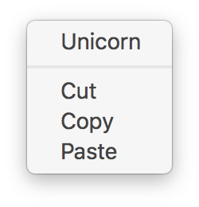

# electron-context-menu [](https://travis-ci.org/sindresorhus/electron-context-menu)

> Context menu for your [Electron](http://electron.atom.io) app



Electron doesn't have a built-in context menu. You're supposed to handle that yourself. But it's both tedious and hard to get right. This module gives you a nice extensible context menu with items like `Cut`/`Copy`/`Paste` for text, `Save Image` for images, and `Copy Link` for links. It also adds an `Inspect Element` menu item when in development to quickly view items in the inspector like in Chrome.

You can use this module directly in both the main and renderer process.


## Install

```
$ npm install --save electron-context-menu
```


## Usage

```js
const {app, BrowserWindow} = require('electron');

require('electron-context-menu')({
	prepend: (params, browserWindow) => [{
		label: 'Rainbow',
		// only show it when right-clicking images
		visible: params.mediaType === 'image'
	}]
});

let win;

app.on('ready', () => {
	win = new BrowserWindow();
});
```


## API

### contextMenu([options])

### options

#### window

Type: `BrowserWindow` `WebView`<br>

Window or WebView to add the context menu to.

When not specified, the context menu will be added to all existing and new windows.

#### prepend

Type: `Function`

Should return an array of [MenuItem](http://electron.atom.io/docs/api/menu-item/)'s to be prepended to the context menu. The first argument is [this `params` object](http://electron.atom.io/docs/api/web-contents/#event-context-menu). The second argument is the [BrowserWindow](http://electron.atom.io/docs/api/browser-window/) the context menu was requested for.

#### append

Type: `Function`

Should return an array of [MenuItem](http://electron.atom.io/docs/api/menu-item/)'s to be appended to the context menu. The first argument is [this `params` object](http://electron.atom.io/docs/api/web-contents/#event-context-menu). The second argument is the [BrowserWindow](http://electron.atom.io/docs/api/browser-window/) the context menu was requested for.

#### showInspectElement

Type: `boolean`<br>
Default: [Only in development](https://github.com/sindresorhus/electron-is-dev)

Force enable or disable the `Inspect Element` menu item.

#### labels

Type: `Object`<br>
Default: `{}`

Overwrite labels for the default menu items. Useful for i18n.

Format:

```js
labels: {
	cut: 'Configured Cut',
	copy: 'Configured Copy',
	paste: 'Configured Paste',
	save: 'Configured Save Image',
	copyLink: 'Configured Copy Link',
	inspect: 'Configured Inspect'
}
```

## Related

- [electron-debug](https://github.com/sindresorhus/electron-debug) - Adds useful debug features to your Electron app
- [electron-config](https://github.com/sindresorhus/electron-config) - Simple config handling for your Electron app or module


## License

MIT © [Sindre Sorhus](https://sindresorhus.com)
